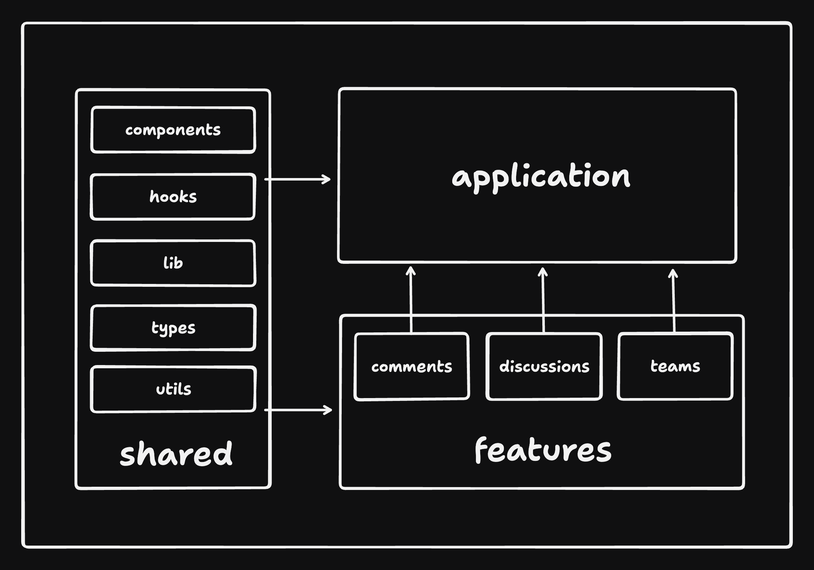

# 🗄️ プロジェクト構成

コードのほとんどは `src` フォルダに配置され、以下のような構成になっています:

```sh
src
|
+-- app               # アプリケーション層（メタフレームワークによって構成が異なる場合あり）
|   |
|   +-- routes        # アプリケーションのルート（pages とも呼ぶ）
|   +-- app.tsx       # メインアプリケーションコンポーネント
|   +-- provider.tsx  # アプリ全体をグローバルプロバイダーでラップするコンポーネント
|   +-- router.tsx    # ルーター設定
+-- assets            # 画像・フォントなどの静的ファイル
|
+-- components        # アプリ全体で共有されるコンポーネント
|
+-- config            # グローバル設定、環境変数のエクスポートなど
|
+-- features          # 機能ベースのモジュール
|
+-- hooks             # アプリ全体で共有されるフック
|
+-- lib               # アプリ向けに設定済みの再利用可能なライブラリ
|
+-- stores            # グローバル状態ストア
|
+-- testing           # テストユーティリティとモック
|
+-- types             # アプリ全体で共有される型定義
|
+-- utils             # 共有ユーティリティ関数
```

スケーラビリティとメンテナンス性のために、コードの大部分は `features` フォルダに整理してください。各 feature フォルダにはその機能に固有のコードだけを置き、共有コンポーネントと機能コードが混在しないようにします。

feature の構成例:

```sh
src/features/awesome-feature
|
+-- api         # その機能に関連する API リクエスト定義と API フック
|
+-- assets      # その機能専用の静的ファイル
|
+-- components  # その機能スコープのコンポーネント
|
+-- hooks       # その機能スコープのフック
|
+-- stores      # その機能の状態ストア
|
+-- types       # その機能内で使用する TypeScript 型
|
+-- utils       # その機能のユーティリティ関数
```

※ すべてのフォルダが毎回必要なわけではありません。機能に必要なものだけを含めてください。

場合によっては、feature フォルダの外に専用の `api` フォルダを置いてすべての API 呼び出しをまとめる方が実用的なこともあります。feature 間で共有される API 呼び出しが多い場合に有用です。

バレルファイル（`index.ts` でまとめてエクスポート）は、Vite のツリーシェイキングに問題を引き起こし、パフォーマンス低下の原因になることがあります。ファイルは直接インポートすることを推奨します。

#### クロスフィーチャーインポートの禁止

feature をまたいだインポートは避け、異なる feature の組み合わせはアプリケーション層で行ってください。これにより各 feature が独立性を保ちます。

ESLint で強制する設定例:

```js
'import/no-restricted-paths': [
    'error',
    {
        zones: [
            // クロスフィーチャーインポートを禁止:
            // 例: src/features/discussions は src/features/comments からインポートできない
            {
                target: './src/features/auth',
                from: './src/features',
                except: ['./auth'],
            },
            {
                target: './src/features/comments',
                from: './src/features',
                except: ['./comments'],
            },
            {
                target: './src/features/discussions',
                from: './src/features',
                except: ['./discussions'],
            },
            // ...
        ],
    },
],
```

#### 単方向アーキテクチャの強制

コードは共有部分からアプリケーションへと一方向に流れるべきです（shared → features → app）。これによりコードベースが予測しやすくなります。



共有部分はコードベースのどこからでも使えますが、features は共有部分からのみインポート可能で、app は features と共有部分の両方からインポートできます。

ESLint で強制する設定例:

```js
'import/no-restricted-paths': [
    'error',
    {
    zones: [
        // 単方向アーキテクチャの強制:
        // src/app は src/features からインポートできるが逆はできない
        {
            target: './src/features',
            from: './src/app',
        },

        // src/features と src/app は共有モジュールからインポートできるが逆はできない
        {
            target: [
                './src/components',
                './src/hooks',
                './src/lib',
                './src/types',
                './src/utils',
            ],
            from: ['./src/features', './src/app'],
        },
    ],
    },
],
```

これらの方針に従うことで、整理された・スケーラブルな・メンテナブルなコードベースを実現できます。Next.js、Remix、React Native で作られたアプリにも同様のアーキテクチャを適用しやすくなります。
